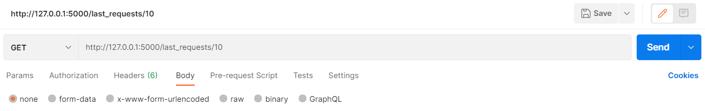

# aruodas-rent-price-predictions
The following has been made as part of the capstone project for module "Data Engineering" on Turing College, a project that encompasses software engineering 
and reproducable research, SQL and data scraping and deployment of machine learning models. The goal of the project is to set up a complete machine learning pipeline, 
from creating a Python package for data collection to training a model using the collected data, deploying it on cloud and making the model accessible via basic API.

Model deployment is part of a process of building a machine learning pipeline. Model (stored here as `regressor.pkl`) used is a multivariate linear regression
that has been trained on the data collected using [**scraperuodas**](https://github.com/virbickt/scraperuodas). In order to access the inferences made by the model, a basic 
Flask application has been created that has two routes: one for making the predictions (`/predict`) and another for retrieving a given number of most recent predictions stored on a database (`/last_records/<desired_number>`).  
 
1. [Introduction](#Introduction)
2. [Installation](#Installation)
3. [Methods](#Methods)
4. [Technologies](#Technologies)
5. [License](#License)
6. [Contact](#Contact)


## Methods
### Application
Application has no interface and is only suitable for sending the input values and receiving predictions in json format using either Python's in-built `requests` or, Postman.
API consists in two routes:
#### predict
- `'/predict'` (POST request type)
Creates a route to return the prediction given the user inputs. Throws errors either if the input could not be processed to a form appropriate for the model.
#### last records
- `'/last_records'` (GET request type)
Creates route to return a specified number of last requests made using the API. Returns 10 requests by default.


### Database
All the predictions along with the input values are stored on the dedicated database on Heroku. Since an adapter, `psycopg2` is required for the interoperation between Python and
Postgre database, all the psycopg2 functionality required to populate the database is encapsulated by `Database` class. 
#### create database
- `create_database()` 
Creates a new table that is to be used for storing predictions. If the table already exists, it is deleted and a new table is initialized. 

  Returns: None
#### create record
- `create_record(request, response)`
Inserts the input provided by the user and the output by the model to the table

  Parameters: 
   - request(str) Input provided by the user which consists of values for each of features that model is using for predicing the target variable. The input is provided using Python's in-built `requests` or, Postman.
   - response(str): Model's predictions for the predicted price given the input values. 

  Returns: None
#### recent records
- `get_recent_records(number_of_records)`
Returns the desired number of most recent results consisting in input-output pairs

  Parameters:
   - *number_of_records*(int): The number of records of input-output pairs that is to be retrieved from the database.
   
  Returns: json object with the specified number of lists for each prediction

## Technologies:
- `Flask, version 1.1.2`
- `psycopg2, version 2.8.6`
- `python-dotenv, version 0.15.0`
- `sklearn`
- `numpy, version 1.20.1`

For a complete list of dependencies, please find [requirements.txt](https://github.com/virbickt/aruodas-rent-price-predictions/blob/main/requirements.txt)

## Examples
### Getting predictions using API
Using Python's in-built `requests` library
```python
import requests
import json

features_for_prediction = {"inputs":
                           [
                               {"number_of_rooms": 1,
                               "area": 31,
                               "floor_on": 5,
                               "floors_total": 9,
                               "district": "Antakalnis"
                               }
                           ]
                          }
  try:
    response = requests.get("http://127.0.0.1:5000/predict", json.dumps(features_for_prediction))

  except requests.exceptions.ConnectionError:
    requests.status_code = "Connection refused"
```
Using Postman:
### Retrieving last records
Using Postman:


## License
The project is licenced under [MIT License](https://github.com/virbickt/aruodas-rent-price-predictions/blob/main/LICENSE.md)

## Contact
[tvirbickas@gmail.com](mailto:tvirbickas@gmail.com?subject=aruodas-rent-price-predictions%20on%20Github)
